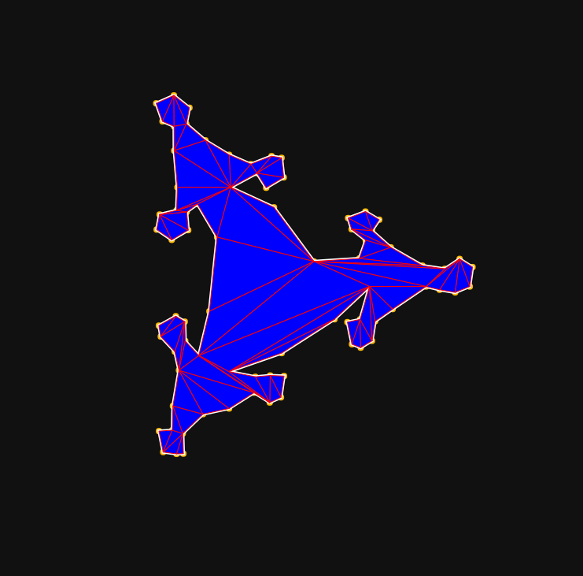

Test of generating triangle meshes from a closed polygon. The closed polygon is made
based on [Sierpinski triangle](https://en.wikipedia.org/wiki/Sierpi%C5%84ski_triangle).
To generate triangle meshes, I used [ear clipping algorithm](https://en.wikipedia.org/wiki/Polygon_triangulation#Ear_clipping_method).

This method does not have the issue I had with Delaunay triangulation ([my repo](https://github.com/ku6ryo/triangle-mesh-test-delaunay)).